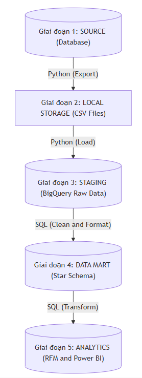

# Hệ thống Business Intelligence (BI) hỗ trợ ra quyết định trong kinh doanh

## Thông tin dự án

- **Tên dự án:** VietTech BI Project - Retail BI & RFM
- **Đơn vị:** Nhóm 9 - Lớp INT 3202E 2
   1. Nguyễn Khánh Kỳ - 24022675
   2. Nguyễn Quốc Khánh - 24022671
   3. Nguyễn Tuấn Dũng - 24022635
   4. Nguyễn Tiến Huy - 24022663
   5. Mai Tuấn Minh - 24022691
   6. Bùi Minh Quân - 24022711

---

## PHẦN 1: TỔNG QUAN DỰ ÁN

### 1.1. Bối cảnh và vấn đề

>Dự án này mô phỏng bài toán xây dựng hệ thống phân tích dữ liệu (BI) cho lĩnh vực bán lẻ. Trong hoạt động thực tế, các luồng dữ liệu nghiệp vụ cốt lõi – bao gồm thông tin khách hàng, chi tiết đơn hàng, danh mục sản phẩm, kênh phân phối, cũng như lịch sử thanh toán và hoàn trả – thường được sinh ra và lưu trữ rải rác tại các cơ sở dữ liệu quan hệ (Relational Database) của hệ thống vận hành (OLTP).

Tuy nhiên, kiến trúc của các database vận hành được thiết kế chủ yếu để xử lý giao dịch hằng ngày một cách nhanh chóng, do đó không tối ưu cho việc truy xuất và tổng hợp báo cáo (OLAP). Nếu người dùng muốn tính toán các chỉ số như doanh thu, lợi nhuận, tỷ lệ hoàn trả, hoặc phân khúc khách hàng theo mô hình RFM, họ thường phải trích xuất thủ công, gom nhóm từ nhiều bảng/file và tự xử lý logic bằng Excel.

Cách làm này dẫn đến một số vấn đề:

- **Tính nhất quán:** KPI dễ bị sai lệch giữa các người dùng hoặc các báo cáo khác nhau.
- **Kiểm soát logic:** Dashboard khó kiểm soát và duy trì logic nếu kết nối trực tiếp dữ liệu thô.
- **Độ phức tạp:** Các bài toán như phân khúc RFM cần nhiều bước xử lý, dễ sai sót nếu làm thủ công.
- **Cấu trúc dữ liệu:** Thiếu một mô hình dữ liệu chuẩn hóa và rõ ràng trước khi đưa vào Power BI.


### 1.2. Giải pháp đề xuất
Để giải quyết các vấn đề trên, dự án xây dựng một luồng xử lý dữ liệu (Data Pipeline) theo hướng chuẩn hóa: dữ liệu nghiệp vụ được cố định dưới dạng các bản chụp tĩnh (Raw CSV Snapshot) để tách biệt khỏi hệ thống vận hành. Từ lớp dữ liệu này, dữ liệu tiếp tục được tải lên vùng đệm Staging và trải qua quá trình chuẩn hóa, biến đổi để tổ chức lại thành mô hình đa chiều (Star Schema) tại tầng Data Mart trên Google BigQuery. Lớp dữ liệu chuẩn hóa này phục vụ trực tiếp cho dashboard Power BI, giúp thống nhất logic và thuận tiện hơn cho việc trình bày báo cáo.


### 1.3. Phạm vi dự án
Trong phạm vi đồ án, dự án không hướng tới các tính năng thường gặp ở môi trường production như xử lý dữ liệu thời gian thực, tải dữ liệu tăng dần hay tự động hóa theo lịch. Thay vào đó, trọng tâm chính là xây dựng một pipeline dữ liệu rõ ràng, nhất quán về logic nghiệp vụ và thuận tiện cho việc đối soát.

### 1.4. Mục tiêu dự án

| Mục tiêu | Ý nghĩa |
|---|---|
| Tách dữ liệu phân tích khỏi database vận hành | Dữ liệu nghiệp vụ ban đầu được xuất thành raw CSV snapshot, giúp quá trình phân tích không truy vấn trực tiếp vào database gốc. |
| Chuẩn hóa dữ liệu phân tích | Đưa raw CSV vào BigQuery staging và chuyển đổi thành Data Mart dạng Star Schema. |
| Xây dựng mô hình BI rõ ràng | Tách fact và dimension để Power BI dễ tạo relationship, slicer và measure. |
| Thống nhất định nghĩa KPI | Đảm bảo doanh thu, lợi nhuận, chiết khấu, số đơn và các chỉ số hoàn trả được hiểu nhất quán giữa SQL và Power BI |
| Phân tích khách hàng bằng RFM | Tạo `mart_rfm_snapshot` cố định tại ngày `2025-01-01` để phân khúc khách hàng theo Recency, Frequency và Monetary. |
| Hoàn thiện dashboard Power BI | Xây dựng dashboard 4 trang: Business Performance, Product, RFM và Order. |


### 1.5. Thuật ngữ và khái niệm cốt lõi

Để thuận tiện cho việc theo dõi kiến trúc và logic phân tích của dự án, dưới đây là các khái niệm cốt lõi về kỹ thuật và nghiệp vụ được sử dụng xuyên suốt tài liệu:

#### 1.5.1. Khái niệm về Kiến trúc Dữ liệu

- **Mô hình Star Schema (Sơ đồ hình sao)**
    - **Định nghĩa:** Là kiến trúc tổ chức dữ liệu trong kho dữ liệu (Data Warehouse) theo chuẩn của Ralph Kimball. Mô hình bao gồm một bảng sự kiện (Fact Table) đóng vai trò trung tâm và các bảng chiều (Dimension Tables) kết nối trực tiếp xung quanh theo dạng hình sao.
    - **Mục đích:** Triệt tiêu các phép JOIN phức tạp và nhiều tầng, tối ưu hóa hiệu năng cho các truy vấn tổng hợp báo cáo (OLAP), đồng thời giúp việc thiết lập các mối quan hệ (Relationships) trên Power BI trở nên trực quan, tường minh.

- **Bảng Fact (Bảng sự kiện) và Bảng Dimension (Bảng chiều)**
    - **Fact Table:** Lưu trữ các số đo định lượng, các chỉ số có thể tính toán được (Measures/Metrics) sinh ra từ hoạt động nghiệp vụ (như doanh thu, số lượng, chiết khấu) và danh sách các khóa ngoại (Foreign Keys) để liên kết với các bảng chiều.
    - **Dimension Table:** Lưu trữ thông tin thuộc tính, mô tả bối cảnh xung quanh sự kiện kinh doanh nhằm phục vụ cho việc lọc và phân nhóm dữ liệu (ví dụ: Khách hàng là ai? Sản phẩm thuộc danh mục nào? Mua qua kênh nào? Vào thời gian nào?).

---

#### 1.5.2. Khái niệm về Mô hình Phân tích Khách hàng (RFM)

Nếu Star Schema giúp tối ưu hóa việc lưu trữ, thì mô hình RFM là khung lý thuyết nghiệp vụ cốt lõi nằm trên Data Mart để giải quyết bài toán phân khúc khách hàng. Thay vì chỉ đánh giá người mua qua một con số doanh thu đơn thuần, RFM chấm điểm hành vi khách hàng dựa trên ba thành phần:

| Thành phần | Ý nghĩa | Giá trị diễn giải |
| :--- | :--- | :--- |
| **Recency (R)** | Khoảng thời gian từ lần mua gần nhất đến ngày chốt dữ liệu. | Càng nhỏ càng tốt, thể hiện khách vẫn đang tương tác gần đây. |
| **Frequency (F)** | Số lần mua hàng thành công trong kỳ phân tích. | Càng lớn càng tốt, thể hiện khách mua thường xuyên, độ trung thành cao. |
| **Monetary (M)** | Tổng giá trị chi tiêu (đây là tổng đơn hàng của khách hàng) từ các đơn hoàn tất. | Càng lớn càng tốt, thể hiện khách mang lại giá trị doanh thu cao. |

**Phương pháp tính toán và phân hạng trong dự án:**

Phù hợp với đặc thù dữ liệu tĩnh của dự án, RFM được tính từ các đơn hàng có trạng thái `Completed` và chốt tại một thời điểm snapshot cố định (`2025-01-01`). Việc này giúp đảm bảo tính ổn định của số liệu khi trình bày và đối soát. 

Hệ thống sử dụng phương pháp **phân vị tương đối** để chấm điểm từ `1` đến `5` cho mỗi tiêu chí (5 là tốt nhất, 1 là thấp nhất). Khách hàng được xếp hạng dựa trên sự so sánh với toàn bộ tập dữ liệu nội bộ thay vì một ngưỡng tuyệt đối. Ba điểm số này ghép lại thành mã `rfm_score` (ví dụ: `555`, `412`) và là cơ sở để phân tập khách hàng thành 5 nhóm hành vi quản trị điển hình:

| Nhóm khách hàng | Đặc điểm hành vi điển hình | Ý nghĩa & Ứng dụng quản trị trên BI Dashboard |
| :--- | :--- | :--- |
| **Champions** | Mua gần đây, tần suất cao, tổng chi tiêu lớn (Điểm R, F, M đều cao). | Nhóm giá trị nhất. Đánh giá độ bền vững của doanh thu; áp dụng các ưu đãi đặc quyền để duy trì trải nghiệm. |
| **Loyal** | Mua tương đối đều đặn, đóng góp doanh thu ổn định. | Nhóm trung thành cốt lõi. Theo dõi tỷ trọng để định hướng chiến lược upsell và cross-sell. |
| **At-risk** | Đã lâu chưa mua lại nhưng trước đó có tần suất/giá trị tốt. | Nhóm có nguy cơ rời bỏ. Dashboard giúp phát hiện sớm để triển khai các chiến dịch win-back (nhắc mua lại). |
| **Churned** | Đã lâu không phát sinh giao dịch, tần suất và giá trị thấp. | Phản ánh mức độ suy giảm của tệp khách hàng, hỗ trợ phân tích nguyên nhân để cải thiện vận hành. |
| **Regular** | Hành vi mua ở mức trung bình, chưa nổi bật. | Nhóm tiềm năng. Phân tích để tìm cơ hội chuyển đổi họ thành nhóm Loyal thông qua các chương trình nuôi dưỡng. |

**Ý nghĩa của RFM đối với hệ thống BI:**

Ở góc độ quản trị, đây là một khác biệt quan trọng. Nếu chỉ dựa trên doanh thu thuần, nhà quản lý có thể đánh giá chưa đúng chất lượng tệp khách hàng. RFM giúp trả lời sâu hơn các câu hỏi chiến lược như:

- Doanh thu hiện tại đang đến từ nhóm khách hàng nào?
- Nhóm khách hàng giá trị cao có còn duy trì tương tác hay đang giảm mức độ mua hàng?
- Có bao nhiêu khách hàng đang có nguy cơ rời bỏ để cần được giữ chân sớm?
- Doanh nghiệp nên ưu tiên ngân sách chăm sóc cho nhóm nào để tối ưu hiệu quả kinh doanh?

Để hiện thực hóa các mục tiêu quản trị trên thành những chỉ số đo lường được trên báo cáo, dự án đã gắn kết chặt chẽ nghiệp vụ RFM vào kiến trúc hệ thống dữ liệu. Thay vì để công cụ BI tự xử lý phân tập, toàn bộ logic chấm điểm và phân hạng được tính toán tập trung và đóng gói cố định tại bảng `mart_rfm_snapshot` ở tầng Data Mart. Sự liên kết này giúp Power BI trực tiếp kế thừa dữ liệu phân tích đã được chuẩn hóa, từ đó đảm bảo các Dashboard luôn hiển thị nhất quán, chính xác và truyền tải trọn vẹn bức tranh chất lượng khách hàng tới người quản trị.


## PHẦN 2: KIẾN TRÚC GIẢI PHÁP VÀ LUỒNG XỬ LÝ DỮ LIỆU

Kiến trúc pipeline dữ liệu của dự án được chia thành 5 lớp chính, đi từ nguồn dữ liệu ban đầu đến lớp trực quan hóa trên Power BI.



Ý nghĩa từng lớp:

| Lớp | Vai trò |
|---|---|
| Source Database | Nơi phát sinh và lưu trữ dữ liệu nghiệp vụ ban đầu của hệ thống bán lẻ (Hệ thống OLTP). |
| Local Storage (Raw CSV)| Lưu trữ dữ liệu nguồn dưới dạng Snapshot cố định tại thư mục data/raw/. Bước đệm này giúp ngắt kết nối hoàn toàn với DB nguồn, cô lập hoàn toàn tiến trình phân tích để không gây ảnh hưởng đến hệ thống vận hành.|
| BigQuery Staging | Vùng đệm trên Cloud (dataset retailbi_stg). Dữ liệu thô từ CSV được load lên đây và giữ nguyên cấu trúc gốc để phục vụ cho việc đối soát dữ liệu và chuẩn hóa ở bước sau.|
| Data Mart (Star Schema) | Tầng kho dữ liệu thu nhỏ (dataset retailbi_mart). Tại đây, SQL pipeline sẽ thực hiện biến đổi (Transform), tổ chức dữ liệu thành mô hình Star Schema (Fact/Dimension), đồng thời tính toán sẵn các BI Views và phân khúc khách hàng (RFM Snapshot). |
| Analytics (Power BI) | Tầng trình diễn và trực quan hóa (Visualization). Power BI sử dụng dữ liệu từ Data Mart để xây dựng dashboard quản trị, trực quan hóa KPI, phân khúc khách hàng, hiệu quả sản phẩm và ngoại lệ vận hành đơn hàng. |

Trong phạm vi triển khai thực tế, dự án không kết nối trực tiếp đến `Source Database`. Lớp này chỉ đóng vai trò mô tả bối cảnh phát sinh dữ liệu, còn dữ liệu đầu vào dùng trong đồ án bắt đầu từ `Raw CSV Snapshot`.

### 2.1. Luồng xử lý dữ liệu tổng thể

Nếu nhìn dưới góc độ hệ thống BI, dự án đi theo một luồng xử lý điển hình nhưng được thu gọn cho phù hợp với phạm vi đồ án:

1. Dữ liệu nghiệp vụ ban đầu phát sinh ở hệ thống nguồn.
2. Dữ liệu được chụp lại thành raw CSV snapshot để tách rời bước phân tích khỏi hệ thống vận hành.
3. CSV được load lên BigQuery staging để kiểm tra tính đầy đủ và giữ bản sao dữ liệu nguồn trên cloud.
4. Dữ liệu staging được biến đổi thành Star Schema trong Data Mart để phục vụ truy vấn phân tích.
5. Từ Data Mart, hệ thống tiếp tục tạo KPI views và bảng RFM snapshot để Power BI sử dụng làm nguồn trực quan hóa.

Mỗi lớp dữ liệu có một vai trò riêng: raw để lưu snapshot, staging để đối soát, mart để phân tích, còn Power BI là lớp diễn giải kết quả cho người dùng cuối. Như vậy, báo cáo có thể giải thích rõ dữ liệu đã được kiểm soát như thế nào trước khi đi vào dashboard.


## PHẦN 3: NỀN TẢNG LÝ THUYẾT VÀ LÝ DO CHỌN CÔNG NGHỆ

### 3.1. Công nghệ sử dụng

| Công nghệ | Vai trò trong dự án |
|---|---|
| Python 3.10+ | Điều phối bước load CSV lên BigQuery và chạy SQL pipeline |
| Google BigQuery | Lưu staging data, tạo Data Mart, chạy SQL transform và BI views | 
| Power BI Desktop | Trực quan hóa dữ liệu thành dashboard | 

### 3.2. Vì sao dùng BigQuery?

BigQuery được chọn vì phù hợp với đặc điểm của dự án theo nhiều khía cạnh:

- **Serverless, không cần quản lý hạ tầng:** BigQuery không yêu cầu cài đặt hay vận hành cluster. Với phạm vi dự án, điều này giúp tập trung vào logic pipeline thay vì cấu hình server.
- **Hỗ trợ SQL chuẩn và phân tách dataset rõ ràng:** Cho phép tổ chức dữ liệu thành `retailbi_stg` và `retailbi_mart` riêng biệt, tách bạch lớp raw và lớp phân tích.
- **Tích hợp tốt với Power BI:** Power BI có connector trực tiếp với BigQuery, giúp kết nối mart dataset vào dashboard không cần export thêm file trung gian.
- **Phù hợp với dữ liệu dạng bảng lớn:** BigQuery tối ưu cho analytical query trên dữ liệu dạng columnar, khác với relational database vận hành vốn được tối ưu cho transactional workload.

### 3.3. Vì sao dùng Star Schema?

Star Schema được chọn thay vì giữ nguyên cấu trúc normalized của relational database gốc vì một số lý do kỹ thuật cụ thể:

- **Giảm số lần JOIN khi truy vấn:** Normalized schema (3NF) yêu cầu nhiều bảng join lại để ra một chỉ số đơn giản. Star Schema đã pre-join dimension vào dạng denormalized, giúp aggregation query chạy nhanh hơn và dễ viết hơn.
- **Power BI làm việc tốt với mô hình star:** Semantic model trong Power BI được thiết kế để thiết lập relationship theo dạng fact–dimension. Nếu dữ liệu vẫn ở dạng normalized nhiều bảng, việc xây dựng measure và slicer phức tạp hơn đáng kể.
- **Tách biệt rõ "số liệu" và "mô tả":** Fact table chứa các sự kiện đo lường được (doanh thu, số lượng, chiết khấu); dimension table chứa ngữ cảnh để lọc và nhóm (khách hàng, sản phẩm, thời gian). Sự tách biệt này giúp người đọc dashboard hiểu logic dữ liệu dễ hơn.

### 3.4. Vì sao dùng Power BI?
Power BI được chọn làm công cụ trực quan hóa dữ liệu (Visualization) ở tầng cuối cùng của pipeline vì phù hợp với kiến trúc và mục tiêu của đồ án:

- **Tương thích tốt với Star Schema:** Lõi Semantic Model của Power BI được thiết kế để làm việc với mô hình Fact-Dimension, giúp thiết lập các Relationship dễ dàng và rõ ràng.

- **Tích hợp Native Connector với BigQuery:** Kết nối và đọc thẳng dữ liệu từ dataset retailbi_mart mà không cần xuất qua file trung gian.

- **Tối ưu hiệu năng hiển thị:** Nhờ logic tính toán nặng (như RFM) đã được xử lý bằng SQL dưới BigQuery, Power BI được giảm tải các hàm DAX phức tạp. Nó chỉ tập trung xử lý cross-filter, nhờ đó cải thiện khả năng phản hồi khi trình bày dashboard.

---

## PHẦN 4: CÁC GIAI ĐOẠN TRIỂN KHAI

### 4.1. Tổng quan các giai đoạn

| Giai đoạn | Nội dung thực hiện | Kết quả đầu ra |
|---|---|---|
| Giai đoạn 1 | Chuẩn bị raw CSV snapshot | 8 file CSV cố định trong `data/raw/` |
| Giai đoạn 2 | Load CSV lên BigQuery staging | Các bảng `stg_*` trong `retailbi_stg` |
| Giai đoạn 3 | Biến đổi dữ liệu staging thành Star Schema | Các bảng `dim_*` và `fact_*` trong `retailbi_mart` |
| Giai đoạn 4 | Tạo lớp phân tích phục vụ BI | `mart_rfm_snapshot`, `vw_monthly_kpi`, `vw_channel_performance` |
| Giai đoạn 5 | Xây dựng Power BI Dashboard | 4 dashboard hoàn chỉnh: Business Performance, Product, RFM và Order |

### 4.2. Giai đoạn 1 - Chuẩn bị raw CSV snapshot

Như đã đề cập, toàn bộ dữ liệu đầu vào được thu thập thông qua quá trình kết xuất (export) từ hệ thống cơ sở dữ liệu vận hành. Dữ liệu này sau đó được đóng băng (snapshot) và lưu trữ dưới dạng file CSV thô trong thư mục `data/raw/`. Đây là lớp dữ liệu nguồn dùng chung cho toàn bộ pipeline ELT, giúp nhóm tách biệt phần phân tích khỏi hệ thống vận hành và đảm bảo mọi lần chạy pipeline đều dựa trên cùng một bộ dữ liệu.

Các file nguồn chính gồm:

- `customers.csv`
- `orders.csv`
- `order_details.csv`
- `order_returns.csv`
- `products.csv`
- `product_categories.csv`
- `product_price_history.csv`
- `sales_channels.csv`

Ở lớp này, dữ liệu được giữ gần với cấu trúc gốc nhất có thể. Nhóm không áp dụng biến đổi nghiệp vụ trực tiếp trên file CSV mà dành phần chuẩn hóa và mô hình hóa cho các bước xử lý phía sau trên BigQuery.

### 4.3. Giai đoạn 2 - Load CSV lên BigQuery Staging

Sau khi chuẩn bị xong raw snapshot, dự án sử dụng script `scripts/etl_csv_to_bq.py` để load toàn bộ CSV lên BigQuery staging. Script này đảm nhận các công việc chính sau:

1. Đọc cấu hình từ `config/.env`, bao gồm `PROJECT_ID`, `BQ_LOCATION`, `BQ_DATASET_STG`, `RAW_DATA_DIR` và `CSV_DELIMITER`.
2. Kiểm tra sự tồn tại của thư mục raw data và xác nhận đủ các file CSV bắt buộc trước khi chạy.
3. Tạo dataset staging nếu chưa tồn tại.
4. Lần lượt nạp từng file CSV vào BigQuery với tên bảng theo mẫu `stg_<table_name>`.
5. Ghi đè dữ liệu bằng `WRITE_TRUNCATE` để phù hợp với đặc điểm dataset cố định và cách chạy full load của đồ án.

Việc tách lớp staging có hai ý nghĩa quan trọng. Thứ nhất, đây là vùng đệm giúp kiểm tra row count và đối soát dữ liệu trước khi transform. Thứ hai, dữ liệu staging vẫn giữ cấu trúc gần với nguồn CSV nên thuận tiện cho đối soát khi phát hiện sai lệch ở tầng mart.

Kết quả của giai đoạn này là dataset `retailbi_stg` với các bảng:

- `stg_customers`
- `stg_orders`
- `stg_order_details`
- `stg_order_returns`
- `stg_products`
- `stg_product_categories`
- `stg_product_price_history`
- `stg_sales_channels`

### 4.4. Giai đoạn 3 - Tạo Star Schema và load Data Mart

Sau khi dữ liệu đã có mặt trong staging, dự án sử dụng script `scripts/run_sql_pipeline.py` để chạy tuần tự các file SQL trong thư mục `sql/`. Thứ tự thực thi được cố định như sau:

1. `01_create_staging_dataset.sql`
2. `02_create_star_schema.sql`
3. `03_load_star_schema.sql`
4. `04_rfm_snapshot.sql`
5. `05_bi_views.sql`

Trọng tâm của giai đoạn này là chuyển dữ liệu từ cấu trúc bảng nguồn sang mô hình Star Schema trong dataset `retailbi_mart`.

Các bảng dimension được tạo gồm:

- `dim_date`
- `dim_customer`
- `dim_product`
- `dim_channel`
- `dim_payment`

Các bảng fact được tạo gồm:

- `fact_orders`
- `fact_order_items`
- `fact_returns`

Trong mô hình này, các fact table không còn join trực tiếp bằng khóa tự nhiên của dữ liệu nguồn mà dùng surrogate key để kết nối với dimension. Riêng `fact_order_items` và `fact_returns` vẫn giữ `order_id` cho mục đích đối soát, nhưng đồng thời bổ sung `order_key` để liên kết nhất quán với `fact_orders` ở tầng BI.

Một số quy tắc biến đổi quan trọng của giai đoạn này gồm:

- `dim_payment` được deduplicate theo `payment_method` trước khi tạo `payment_key`.
- `fact_order_items.order_date_key` lấy từ order header để đảm bảo đúng ngữ nghĩa phân tích theo ngày đơn hàng.
- `ship_date_key` dùng ba giá trị đặc biệt `-1`, `-2`, `-3` để phân biệt dữ liệu bất thường, chưa giao và không áp dụng.
- `dim_date` được bổ sung các dòng đặc biệt tương ứng với `ship_date_key` để Power BI có thể xử lý nhất quán.

Kết quả của giai đoạn này là một Data Mart dạng hình sao, đóng vai trò là nguồn dữ liệu chuẩn hóa cho phân tích và trực quan hóa sau này.

### 4.5. Giai đoạn 4 - Tạo RFM Snapshot và BI Views

Sau khi Star Schema hoàn tất, dự án tiếp tục tạo lớp phân tích phục vụ báo cáo. Lớp này gồm hai nhóm thành phần chính.

Thứ nhất là bảng `mart_rfm_snapshot`, được tính từ `fact_orders` với điều kiện chỉ lấy các đơn hàng có trạng thái `Completed`. Snapshot date hiện được cố định tại:

```text
2025-01-01
```

Từ đó, hệ thống tính ba thành phần RFM:

- **Recency:** số ngày kể từ lần mua gần nhất đến ngày snapshot.
- **Frequency:** số lượng đơn hàng completed của khách hàng.
- **Monetary:** tổng giá trị chi tiêu của khách hàng trên các đơn completed.

Thứ hai là các BI views dùng để chuẩn hóa KPI và hỗ trợ đối soát nhanh:

- `vw_monthly_kpi`
- `vw_channel_performance`

Các view này không thay thế fact table trong phân tích chi tiết, nhưng rất hữu ích cho việc kiểm tra định nghĩa KPI, đối chiếu số liệu tổng hợp và làm nguồn tham khảo khi dựng dashboard ở giai đoạn sau.

### 4.6. Tổng kết luồng ELT và ý nghĩa đối với hệ thống BI

Trải qua các giai đoạn từ xử lý dữ liệu thô đến mô hình hóa (Giai đoạn 1 đến Giai đoạn 4), kết quả quan trọng nhất của tiến trình ELT là kiến tạo thành công một Data Mart phân tích ổn định và chặt chẽ về mặt logic, làm bệ phóng vững chắc cho lớp trực quan hóa trên Power BI. Cụ thể, kiến trúc dữ liệu này mang lại các giá trị cốt lõi sau:

- **Tối ưu hóa mô hình dữ liệu:** Toàn bộ dữ liệu nguồn đã được chuyển đổi thành công lên nền tảng đám mây (BigQuery) và tái cấu trúc theo mô hình Star Schema, giúp tối ưu hóa hiệu suất truy vấn cho các công cụ BI.
- **Chuẩn hóa liên kết thực thể:** Mối quan hệ phức tạp giữa khách hàng, đơn hàng, sản phẩm, kênh phân phối và lịch sử hoàn trả được quản lý nhất quán thông qua hệ thống khóa thay thế (surrogate keys).
- **Đồng nhất hóa logic tính toán KPI:** Các chỉ số đo lường cốt lõi (bao gồm cả các thành phần trong mô hình RFM với tiêu chí tổng giá trị chi tiêu của khách hàng được định nghĩa chặt chẽ) đều được tính toán tập trung tại tầng dữ liệu thông qua các Fact table và BI Views. Điều này giúp thiết lập một "Single Source of Truth", tránh tình trạng phân mảnh logic hay sai lệch số liệu khi tự diễn giải trên từng báo cáo BI riêng lẻ.
- **Sẵn sàng cho tích hợp trực tiếp:** Lớp dữ liệu phân tích đã được định dạng chuẩn mực, cho phép Power BI kết nối, đọc hiểu và khai thác trực tiếp một cách liền mạch mà không cần thực hiện thêm các bước biến đổi phức tạp ở tầng ứng dụng.

Như vậy, quá trình ELT đã hoàn thành trọn vẹn vai trò nền tảng: chuyển hóa dữ liệu thô thành một tập dữ liệu sạch, chuẩn hóa, có cơ sở đối soát rõ ràng để chuẩn bị cho bước xây dựng Dashboard quản trị tiếp theo.

### 4.7. Giai đoạn 5 - Xây dựng Power BI Dashboard

Trên nền dataset `retailbi_mart`, nhóm đã kết nối Power BI Desktop với BigQuery và xây dựng dashboard theo 4 góc nhìn phân tích: Business Performance, Product, RFM và Order. Ở giai đoạn này, dashboard không lấy dữ liệu trực tiếp từ raw hay staging mà sử dụng fact table, dimension table và một số BI views ở tầng mart để đảm bảo KPI được hiển thị nhất quán với logic đã chuẩn hóa trong SQL.

Kết quả của giai đoạn này là lớp trực quan hóa hoàn chỉnh trong phạm vi đồ án. Người dùng có thể theo dõi hiệu quả kinh doanh tổng quan, phân tích danh mục sản phẩm, quan sát phân khúc khách hàng theo RFM và nhận diện các ngoại lệ trong vòng đời đơn hàng trên cùng một hệ thống BI thống nhất.

---

## PHẦN 5: DASHBOARD POWER BI

### 5.1. Vai trò của dashboard

Dashboard Power BI là lớp trình diễn cuối cùng của toàn bộ hệ thống BI. Sau khi dữ liệu đã được chuẩn hóa ở BigQuery thành Data Mart và các KPI đã được tổ chức nhất quán giữa lớp dữ liệu mart, BI views và Power BI, Power BI đóng vai trò chuyển các kết quả đó thành thông tin quản trị dễ quan sát, dễ lọc và dễ so sánh hơn cho người dùng cuối.

Dashboard được xây dựng để trả lời bốn nhóm câu hỏi chính:

- Doanh nghiệp đang vận hành ra sao ở góc nhìn doanh thu, lợi nhuận, đơn hàng và hoàn trả?
- Sản phẩm và kênh bán nào đang đóng góp tốt hơn vào kết quả kinh doanh?
- Tệp khách hàng đang được phân hóa như thế nào theo hành vi mua hàng?
- Những ngoại lệ nào trong trạng thái đơn hàng, hoàn trả và hủy đơn cần được theo dõi?

### 5.2. Cấu trúc dashboard thực tế

Dashboard hiện tại gồm 4 trang chính, tương ứng với 4 nhóm phân tích của hệ thống BI:

| Trang | Câu hỏi kinh doanh chính | KPI / nội dung chính | Nguồn dữ liệu chính |
|---|---|---|---|
| Business Performance Dashboard | Hiệu quả kinh doanh tổng quan đang như thế nào? | Doanh thu đơn hoàn tất, số đơn hoàn tất, giá trị đơn hàng trung bình, tỷ lệ hoàn trả, xu hướng đơn hàng, doanh thu theo kênh, doanh thu theo sản phẩm, biên lợi nhuận gộp theo thương hiệu | `fact_orders`, `fact_order_items`, `dim_date`, `dim_channel`, `dim_product`, `vw_monthly_kpi`, `vw_channel_performance` |
| Product Dashboard | Danh mục sản phẩm nào tạo doanh thu và lợi nhuận tốt hơn? | Doanh thu và lợi nhuận theo danh mục, tốc độ bán sản phẩm, xu hướng doanh thu theo quý, chiết khấu - doanh thu - số lượng theo sản phẩm và thương hiệu | `fact_order_items`, `fact_orders`, `dim_product`, `dim_channel` |
| RFM Dashboard | Khách hàng đang được phân nhóm ra sao theo hành vi mua hàng? | Số khách theo `rfm_segment`, giá trị chi tiêu theo segment, bảng chi tiết khách hàng, độ gần đây, tần suất mua, gợi ý hành động theo segment | `mart_rfm_snapshot`, `dim_customer` |
| Order Dashboard | Những ngoại lệ và đặc điểm vận hành đơn hàng cần theo dõi là gì? | Phương thức thanh toán theo kênh, tổng số đơn theo trạng thái, tỷ lệ hủy theo kênh, tỷ lệ hoàn trả theo ngữ cảnh sản phẩm, chi tiết ngoại lệ đơn hàng | `fact_orders`, `fact_returns`, `fact_order_items`, `dim_channel`, `dim_payment`, `dim_product`, `dim_date` |

Mỗi trang đều có nguồn dữ liệu rõ ràng và bám sát một nhóm câu hỏi kinh doanh cụ thể, tránh việc Power BI phải tự tái hiện lại logic nghiệp vụ từ dữ liệu thô.

### 5.3. Định nghĩa KPI chính trên dashboard

Để tránh hiểu sai ý nghĩa của các KPI trên dashboard, dự án diễn giải trực tiếp các chỉ số cốt lõi như sau:

| KPI | Ý nghĩa | Vai trò trong phân tích |
|---|---|---|
| Doanh thu đơn hoàn tất | Doanh thu từ các đơn hàng đã hoàn tất | Phản ánh kết quả bán hàng thực sự đã được ghi nhận |
| Số đơn hoàn tất | Số lượng đơn hàng đã hoàn tất | Cho biết quy mô giao dịch thành công trong kỳ phân tích |
| Giá trị đơn hàng trung bình (AOV) | Giá trị trung bình của một đơn hàng hoàn tất | Giúp đánh giá mức chi tiêu bình quân của khách hàng trên mỗi đơn |
| Tỷ lệ hoàn trả | Tỷ lệ đơn hàng phát sinh hoàn trả trên tổng số đơn hàng | Giúp đánh giá mức độ hoàn trả và theo dõi rủi ro về chất lượng sản phẩm, trải nghiệm khách hàng hoặc quy trình vận hành |
| Biên lợi nhuận gộp | Tỷ lệ lợi nhuận gộp trên doanh thu | Giúp đánh giá hiệu quả sinh lời tương đối giữa các thương hiệu, nhóm sản phẩm hoặc kênh bán |
| Lợi nhuận | Phần giá trị còn lại sau khi trừ chi phí khỏi doanh thu | Cho biết đóng góp lợi nhuận tuyệt đối của từng nhóm phân tích |

Ở lớp tổng quan của dashboard, các chỉ số doanh thu, số đơn, giá trị đơn hàng trung bình, lợi nhuận và biên lợi nhuận gộp được ưu tiên hiểu theo các đơn hàng ở trạng thái `Completed`. Riêng tỷ lệ hoàn trả được diễn giải theo ngữ cảnh lọc của dashboard.

### 5.4. Business Performance Dashboard

Trang Business Performance Dashboard là trang tổng quan điều hành, tập trung vào việc cho thấy bức tranh kinh doanh chung của doanh nghiệp trên dataset hiện tại. Trang này sử dụng các KPI card ở phần trên để thể hiện nhanh doanh thu đơn hoàn tất, số đơn hoàn tất, giá trị đơn hàng trung bình và tỷ lệ hoàn trả, sau đó bổ sung các biểu đồ xu hướng và cơ cấu để giải thích sâu hơn kết quả tổng quan.

- KPI card: Doanh thu đơn hoàn tất, số đơn hoàn tất, giá trị đơn hàng trung bình, tỷ lệ hoàn trả.
- Biểu đồ xu hướng số đơn theo tháng.
- Biểu đồ donut doanh thu theo loại kênh bán.
- Biểu đồ doanh thu theo sản phẩm.
- Bảng biên lợi nhuận gộp theo từng thương hiệu.

Trong trang này, chỉ số doanh thu đơn hoàn tất và số đơn hoàn tất đều chỉ tính các đơn hàng có trạng thái `Completed`, nhằm tránh ghi nhận doanh thu hoặc số đơn từ các trạng thái chưa hoàn tất hay đã hủy.


*Hình 5.1. Business Performance Dashboard*

### 5.5. Product Dashboard

Trang Product Dashboard đi sâu vào hiệu quả kinh doanh ở cấp sản phẩm và danh mục. So với trang tổng quan, trang này hỗ trợ tốt hơn cho việc so sánh giữa các danh mục, theo dõi mối quan hệ giữa chiết khấu và doanh thu, cũng như xác định các sản phẩm có tốc độ bán cao trong kỳ.

- Biểu đồ doanh thu và lợi nhuận theo danh mục.
- Biểu đồ bubble thể hiện chiết khấu, doanh thu và số lượng bán theo sản phẩm và thương hiệu.
- Biểu đồ tốc độ bán sản phẩm theo tháng ở cấp sản phẩm.
- Biểu đồ xu hướng doanh thu theo quý và danh mục.


*Hình 5.2. Product Dashboard*

### 5.6. RFM Dashboard

Trang RFM Dashboard là lớp phân tích khách hàng chuyên biệt của hệ thống. Trang này dùng trực tiếp `mart_rfm_snapshot` để thể hiện phân khúc hành vi khách hàng, thay vì tính RFM động trong Power BI. Nhờ đó, logic phân nhóm được cố định và nhất quán với phần mô hình hóa đã trình bày ở các phần trước.

- Treemap thể hiện tổng số khách hàng theo `rfm_segment`.
- Biểu đồ cột thể hiện giá trị chi tiêu theo từng segment.
- Bảng chi tiết khách hàng gồm thành phố, `rfm_segment`, `monetary_value`, `recency_days`, `frequency_orders` và gợi ý hành động theo segment.

Trang này đặc biệt hữu ích khi trình bày ý nghĩa ứng dụng của RFM trong BI, vì nó cho thấy không chỉ khách hàng được chia thành nhóm nào mà còn gợi mở cách doanh nghiệp có thể hành động với từng nhóm khách hàng cụ thể. Phần gợi ý hành động được thể hiện ở lớp dashboard dựa trên phân khúc RFM.


*Hình 5.3. RFM Dashboard*

### 5.7. Order Dashboard

Trang Order Dashboard tập trung vào khía cạnh vận hành đơn hàng và các ngoại lệ nghiệp vụ. Nếu các trang trước thiên về doanh thu, sản phẩm và khách hàng, thì trang này giúp theo dõi trạng thái đơn hàng, kênh có tỷ lệ hủy cao và các trường hợp bất thường cần chú ý trong quá trình xử lý đơn.

- Bảng phân bố phương thức thanh toán theo từng kênh.
- Biểu đồ tổng số đơn theo trạng thái.
- Biểu đồ tỷ lệ hủy theo kênh.
- Bảng tỷ lệ hoàn trả theo ngữ cảnh sản phẩm hoặc nhóm sản phẩm.
- Bảng chi tiết ngoại lệ đơn hàng để xem các đơn hàng có trạng thái cần chú ý.


*Hình 5.4. Order Dashboard*

### 5.8. Nhận xét chung về lớp dashboard

Với 4 trang dashboard trên, hệ thống BI của dự án đã có đủ các lớp phân tích từ tổng quan kinh doanh, sản phẩm, khách hàng đến vận hành đơn hàng. Điều quan trọng về mặt học thuật là dashboard này không được xây dựng trực tiếp từ dữ liệu thô, mà dựa trên một lớp Data Mart đã chuẩn hóa sẵn. Nhờ đó, báo cáo có thể chứng minh được mối liên hệ chặt chẽ giữa kiến trúc dữ liệu, logic KPI và kết quả trực quan hóa cuối cùng.

---

## PHẦN 6: ĐÁNH GIÁ KẾT QUẢ ĐẠT ĐƯỢC

Sau khi hoàn thành pipeline ELT và dashboard BI trong phạm vi hiện tại, dự án đạt được các kết quả chính sau:

| Tiêu chí | Trước khi chuẩn hóa | Sau khi triển khai trong phạm vi dự án | Ý nghĩa |
|---|---|---|---|
| Tổ chức dữ liệu | Dữ liệu raw/nguồn khó dùng trực tiếp cho BI | Dữ liệu được đưa vào BigQuery và tổ chức thành Data Mart | Tạo ra nguồn dữ liệu rõ ràng và dễ đối soát hơn |
| Mô hình phân tích | Dữ liệu chưa tối ưu cho slicer, relationship và measure | Star Schema tách fact và dimension, dùng surrogate key | Thuận lợi cho việc xây dựng semantic model và dashboard Power BI |
| Định nghĩa KPI | KPI dễ bị hiểu khác nhau | KPI được tổ chức nhất quán qua fact table, BI views và dashboard | Giảm rủi ro lệch nghĩa giữa dữ liệu và báo cáo |
| RFM | Phân khúc khách hàng có thể phải tính thủ công | Có `mart_rfm_snapshot` cố định | Tạo sẵn lớp dữ liệu phân tích khách hàng phục vụ BI |
| Dashboard Power BI | Chưa có lớp trực quan hóa hoàn chỉnh | Đã xây dựng 4 dashboard dựa trên `retailbi_mart` | Giúp người dùng quan sát KPI, xu hướng, phân khúc và ngoại lệ nghiệp vụ trực quan hơn |

---

## PHẦN 7: KẾT LUẬN

Ở giai đoạn hiện tại, dự án VietTech BI đã xây dựng được một luồng BI tương đối đầy đủ trong phạm vi đồ án. Bắt đầu từ raw CSV snapshot, hệ thống đã nạp dữ liệu lên BigQuery staging, biến đổi sang mô hình Star Schema tại tầng Data Mart, tạo lớp RFM snapshot và BI views để hỗ trợ chuẩn hóa KPI, sau đó kết nối Power BI để xây dựng 4 dashboard phân tích phục vụ báo cáo.

Giá trị cốt lõi mà dự án đã đạt được trong giai đoạn này gồm:

- Chuẩn hóa dữ liệu thô thành mô hình phân tích rõ ràng.
- Thống nhất cách hiểu KPI giữa lớp dữ liệu mart, BI views, Power BI và tài liệu.
- Tạo được RFM snapshot phục vụ phân tích khách hàng.
- Hoàn thiện dashboard Power BI 4 trang dựa trên nguồn dữ liệu mart đã chuẩn hóa.
